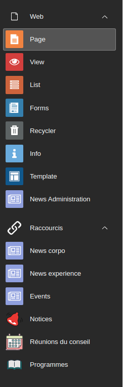

.. include:: ../Includes.txt

.. _introduction:

============
Introduction
============

What does it do?
================

Add shortcut as modules to specific folder for record list view

Screenshots
===========

Example of modules

